[![Discourse Topics][discourse-shield]][discourse-url]
[![Issues][issues-shield]][issues-url]
[![Latest Releases][release-shield]][release-url]
[![Contributor Shield][contributor-shield]][contributors-url]

[discourse-shield]: https://img.shields.io/discourse/topics?label=Discuss%20This%20Tool&server=https%3A%2F%2Fdeveloper.sailpoint.com%2Fdiscuss
[discourse-url]: https://developer.sailpoint.com/discuss/tag/workflows
[issues-shield]: https://img.shields.io/github/issues/sailpoint-oss/repo-template?label=Issues
[issues-url]: https://github.com/sailpoint-oss/repo-template/issues
[release-shield]: https://img.shields.io/github/v/release/sailpoint-oss/repo-template?label=Current%20Release
[release-url]: https://github.com/sailpoint-oss/repo-template/releases
[contributor-shield]: https://img.shields.io/github/contributors/sailpoint-oss/repo-template?label=Contributors
[contributors-url]: https://github.com/sailpoint-oss/repo-template/graphs/contributors

# Identity Fusion SaaS Connector

[Explore the docs »](https://developer.sailpoint.com/discuss/t/identity-fusion-connector/38793)

[New to the CoLab? Click here »](https://developer.sailpoint.com/discuss/t/about-the-sailpoint-developer-community-colab/11230)

## Changelog

-   0.0.3 (2024-04-03):
    -   Updated sailpoint-api-client to v1.3.2
    -   Added keepalive messages to account aggregation process
-   0.0.2 (2024-04-02):
    -   Initial public release

## Identity Fusion SaaS Connector 

There are two common challenges Identity Security Cloud (ISC) admins and source admins face when they aggregate identity data: 

1. ISC doesn't have a built-in mechanism to generate unique identifiers for identities and handle value collision. There are ways to resolve this issue, but they are complex and may require the use of external systems, which you must then maintain. 

2. ISC's typical correlation process, which involves finding an identical match based on various identity attributes, can fail and generate duplicated identities when the data isn't 100% accurate, which is common. 

The Identity Fusion SaaS Connector solves both these problems: 

- To solve the first, the connector provides an identifer template you can use to configure the generation of unique identifiers and handle value collision. 

- To solve the second, the connector provides a duplication check you can use to review identities and prevent their duplication in ISC. The connector also provides an account merging configuration that controls how it merges account attributes from different schemas and maps the account attributes to identity attributes. 

You can use these features independently or together. 

## Unique ID creation

The fusion connector provides a template you can use to configure the generation of unique identifiers. This template offers you a simple way to, in ISC, configure typical string manipulation options, like normalizing special characters and removing spaces. This template is based on Velocity for flexibility and standardization, including the placement of the disambiguation counter. 

In addition to the template-based unique identifier, the connector assigns an immutable universally unique identifier (UUID) to the account, which you can synchronize with all the identity's accounts. 

https://github.com/sailpoint-oss/colab-saas-conn-identity-fusion/assets/64795004/0533792f-7f12-42a9-93d2-bb519260f0b4

This UUID also supports reevaluation, which may be necessary when infrequent changes occur, such as a surname change, which would make the previous value incorrect.

The fusion connector's identifier creation process occurs during account aggregation. When the connector creates the identifiers, the aggregation context prevents race conditions, errors that occur when multiple processes try to access the same resource at the same time. The connector reads previously aggregated accounts and compares these existing accounts to the current list to detect accounts that haven't been processed yet. 

Because the connector is deciding whether to create new accounts or update existing ones, each run starts by processing completed form instances generated by previous runs. With each run, the connector updates proxy accounts with data resulting from deduplication actions, as well as new sourec account data. 

Refer to [Configure unique IDs](#configure-unique-ids) to learn more about how to configure the fusion connector's unique ID generation. 

## Deduplication  

The fusion connector provides a similarity check that prevents the duplication of identities. 

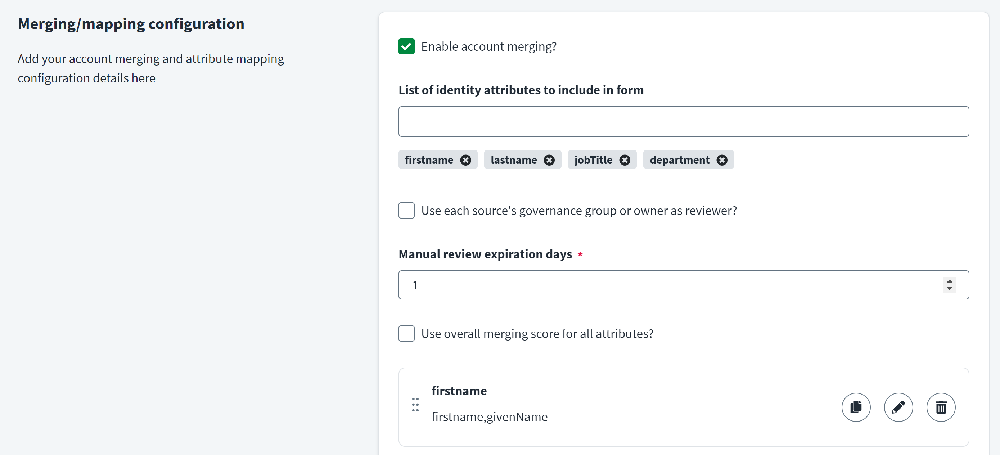

The connector checks new accounts for similarity, and if it determines the accounts are similar to one or more identities (based on a minimum similarity score), it submits the accounts for manual review to configured reviewers. The fusion connector's source is authoritative, so when it processes accounts that don't have similar existing identities, it generates new ones.

This is the deduplication process:

When the fusion connector finds a potential match, based on an attribute similarity check, it generates form instances for reviewers to check. ISC sends the reviewer an email, prompting the reviewer to check for a potential identity merge. 

The first reviewer to complete the form decides what to do with the account: create a new identity or link it to an existing one. 

Once the reviewer makes a decision, the connector either correlates the new account with an existing identity or creates a new one, and it updates the account's history accordingly. 

In addition to this deduplication process, you can still use conventional correlation from the original account sources. This makes the process very flexible. 

Refer to [Configure deduplication](#configure-deduplication) to learn more about how to configure this deduplication feature in the connector. 

## Mapping and merging accounts

When the fusion connector is deduplicating identities, it generates proxy accounts that result from merging account data from multiple sources. Sources may present different account schemas, so the connector can discover the account schema that results from combining the configured sources' schemas. The account merging configuration controls how account attributes map to identity attributes for comparison and also how to handle multiple accounts contributing to the same attribute. 

Because the connector is comparing new accounts from multiple sources with existing identities, you must map account attributes to identity attributes, which results in a combined schema from all configured sources, as well as a series of normalized attributes. 

When multiple source accounts contribute to a proxy account, there may be multiple values for the same attribute. The connector allows you to keep all values or only one. 

Keeping all values for an attribute can be useful in situations where multiple accounts can contribute to an identity attribute, like multiple job descriptions for the same person. You can then use these values in role assignments or searches. 

 

## Connector modes

When you're configuring the fusion connector, you must first decide whether you want it to be an authoritative or regular source: 

- **Authoritative source**: An authoritative source is an organization's primary source, providing a complete list of its identities, like an HR application or Active Directory. To use deduplication, you must configure the fusion connector as an authoritative source because it's reading all the identities from a list of sources that may otherwise be authoritative sources themselves. When the connector merges account data, it creates proxy accounts, so the original accounts are not necessary to build the identity profile. The proxy accounts directly provide all account attribute data. To learn more about authoritative sources in ISC, refer to [Prioritizing Authoritative Sources](https://documentation.sailpoint.com/saas/help/setup/identity_profiles.html#prioritizing-authoritative-sources).

- **Regular source**: If you only need to generate unique identifiers and you aren't worried about duplication, you can configure the fusion connector as a regular source. When you're using the connector as a regular source, the connector uses the identifiers associated with the identity profiles linked to the sources included in the connector's configuration. When you use the connector as a regular source, you must ensure the following: 

    - All sources for the identity profiles you want to generate unique identifiers for are included in the list.

    - The 'Include existing identities' option is enabled.

    - The unique ID scope is set to 'Source'.

    - The attributes the Velocity template is using either exist in the account schema or are mapped identity attributes. 

Whether you use the fusion connector as an authoritative or regular source, the connector generates proxy accounts based on the configured sources and the the connector's other configuration options. These proxy accounts are the result of merging all source account attributes, normalized attributes based on the connector's configuration, and this set of mandatory attributes: 

- **id**: The template-based unique identifier.

- **uuid**: The immutable universally unique identifier.

- **accounts**: The list of source accounts IDs linked to the proxy account.

- **history**: The chronological history of operations performed on the account.

- **status**: The list of entitlements used as tags to identify the account's origin. 

- **reviews**: The list of pending form instances a reviewer must attend to.

## Account aggregation 

ISC uses account aggregation to pull account data from its connected sources and update the identities correlated with those accounts. When you run an account aggregation for the first time, the fusion connector creates an account baseline. This baseline doesn't affect the creation of unique identifiers, which are always unique regardless of the batch they're created on, but it's essential for deduplication, which requires a list of identities to compare incoming account data to. You can add more sources to the configuration, and the connector will compare account data from those sources with this baseline. 

When the connector creates new proxy accounts, it returns them as 'disabled'. It disables the accounts by default because the connector is an authoritative source. This means that when it creates new identities for new accounts, the identities don't exist, so it cannot correlate them yet. Disabling the accounts allows you to quickly correlate the proxy accounts with their source accounts. The best practice is to configure the identity profile so it automatically enables proxy accounts, triggering correlation with their source accounts. Alternatively, the next account aggregation will run any pending account correlations. 

Disabling an account triggers a template-based unique identifier reevaluation. It's recommended that you configure the 'UUID' as the account's 'native identity' and 'name'. UUID works well as a native identity because native identities cannot be changed, and it works well as a name because the account name must not change if you want to keep the identity. 

:::note

You can reenable or reaggregate a disabled account so it appears enabled. 

:::

You can find a diagram of the fusion connector's aggregation process here: [Account aggregation process diagram](https://miro.com/app/board/uXjVNgEpRGs=/)

## Correlation

The fusion connector's correlation configuration depends on whether you are using the connector as an authoritative or regular source: 

- **Authoritative source**: When you use the connector as an authoritative source, reviewer accounts always get the identity’s UID as unique identifier. Therefore, when you use deduplication, you must set correlation between an identity’s UID and the account’s ID.

- **Regular source**: To correlate proxy accounts directly with corresponding identities, you must identify the account attributes the connector can match with identity attributes. This configuration depends on the actual data, and it's the same as any other source account correlation. 

## Get started 

To configure the fusion connector in ISC, you must follow these steps. 

## Prerequisites 

Before you can configure the fusion connector and fuse identities from multiple sources, you must ensure the following: 

- The sources you want to aggregate account data from are already configured. 
- ISC has already aggregated account data from those sources. 

To learn how to configure sources and aggregate source account data in ISC, refer to [Loading Account Data](https://documentation.sailpoint.com/saas/help/accounts/loading_data.html). 

### Configure tenant authentication 

The fusion connector must be able to authenticate to the the data source to be able to read its data and make changes in ISC. 

To configure the connector's authentication, follow these steps: 

1. Enter your ISC tenant URL. 

2. Enter the client ID for your personal access token (PAT).

3. Enter the client secret for your PAT.

## Configure primary source

Once you have your sources configured and have aggregated account data from those sources, you can configure the source that will serve as your primary source. This primary (initial) source builds the baseline for all the identities the connector will compare other secondary sources to. You will set up the primary source's base configuration, which controls details like which sources the fusion connector should read and how to handle account data from those sources. With the fusion connector, you can merge account attributes from different sources and configure how the connector merges account attributes from multiple sources. To configure the primary source's base configuration, follow these steps: 

1. Specify the account source you want to read from (required). 

2. Determine how you want to merge account attributes from multiple sources from these options (required): 

    - **First found**: The connector uses the first value it finds for an account, based on the set source order, to populate the account attribute.

    - **Make multi-valued entitlement**: The connector creates a list of unique values from all accounts contributing to the account attribute.

    - **Concatenate values**: The connector creates a concatenated string of unique values, enclosed in square brackets, from all accounts contributing to the same account attribute.

3. Enable these options (optional): 

    - **Delete accounts with no authoritative accounts left?**: This determines whether the connector deletes the proxy account when there are no linked accounts remaining. 

    - **Reset accounts?**: Use this option to reset current accounts from the source.

    - **Force source aggregation?**: Use this option to force an account aggregation from the source. 

## Configure unique ID generation

The next step to configuring the fusion connector is to set up its unique ID configuration. This unique ID configuration determines how the connector generates unique IDs for identities. 

To configure unique ID generation, follow these steps: 

1. Determine the scope for the unique IDs by using one of these options (required): 

    - **Source**: The connector only considers source accounts when it calculates unique IDs.

    - **Platform**: The connector considers both source account IDs and all identities' UIDs when it calculates unique IDs.

2. Specify an Apache Velocity template (required). The connector uses this template to generate unique IDs. The Apache Velocity context is based on the account attributes. It's best to use normalized, attributes. Make sure the fields you reference in the velocity template exist in your source or in the mapping configuration you will provide in the following section. 

3. Enable these options (optional): 

    - **Normalize special characters?**: The connector will remove special characters and quotes. This option is recommended. 

    - **Remove spaces?**: The connector will remove spaces from the source account data. 

4. **Minimum counter digits** (required): This is the zero-based padding the connector adds to the disambiguation counter. 

5. Choose one of these options to determine how the connector handles case selection (required): 

    - **Do not change**: The connector doesn't make any changes to incoming strings' casing. 

    - **Lower case**: The connector changes incoming strings to lower case. 

    - **Upper case**: The connector changes incoming strings to upper case. 

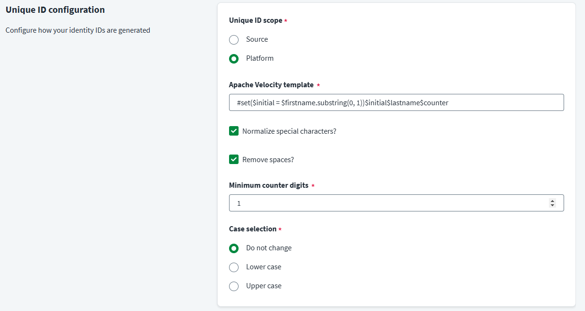

In most cases, your configuration will be similar to the one in this screenshot, but your velocity template may be different. Ensure that the fields the velocity template references exist in the source or in the mapping configuration you provide in the next section.

## Configure mapping and merging

When you aggregate account data from different sources, that data will often be stored in different formats from the format ISC uses for your identity data. To standardize the attribute data between identities and their correlated source accounts, you must configure how the connector maps account attributes with identity attributes. This configuration not only maps incoming source attributes to existing identity attributes in ISC, but it also determines how the fusion connector merges incoming source account data. This configuration depends on the source account attributes themselves, and you must decide which ones make sense to compare and map to identity attributes in ISC. 

To configure merging and mapping, follow these steps: 

1. **Enable account merging** (optional): With this option enabled, the connector merges incoming source account data when you want it to. 

2. **List of identity attributes to include in form** (optional): Specify the identity attributes you want to map incoming source account data to. 

3. **Manual review expiration days** (required): This value sets the number of days until the deduplication review form expires. 

4. **Use overall merging score for all attributes?** (optional): With this option enabled, the connector uses the overall merging score for all attributes to determine whether to merge attributes from multiple sources. If this option isn't enabled, you must assign a score for each attribute so the connector can determine whether to merge incoming account data for those attributes. 

5. **Add attribute mapping** (optional): Add the source account attributes you want to potentially map to identity attributes in ISC. These attribute mappings depend on the source account attributes themselves, and you must decide which ones you want to map to identity attributes in ISC. 

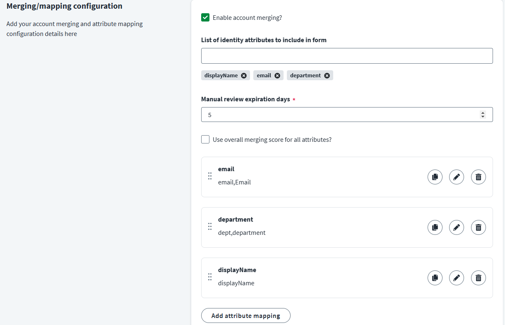

In this example, there are two 'email' fields ('email' and 'Email') from the two sources you want to aggregate data from, two 'department' fields ('dept' and 'department'), and a 'display name' field ('displayName'). Because an email and a display name should be the same for a source account and its correlated identity in ISC, the connector will only use the 'email' and 'displayName' fields for duplication detection. 

However, a source account may have multiple departments correlated with the same identity, so the connector will concatenate the 'department' fields into one field. This way, you can easily see incoming departments from both sources in the form of a concatenated list. You can also combine fields into one to use the field for the velocity template and unique ID configuration. 

## Discover schema

Each source has an account schema, or set of account attributes that accounts on the source can have. For sources whose schema are discoverable, ISC connectors can discover these schema and read these attributes. The fusion connector supports discovering source account schema. The connector can even build this schema for multiple sources by merging the multiple configured sources' schemas. 

To discover a source's account schema, run 'Discover Schema' in the 'Account Schema' section. When the fusion connector discovers the source schema, it pulls in the account schema from the primary source. This account schema will include the attributes you mapped, as well as others you may have decided didn't need mapping and/or potential merging. To learn more about source account schema and schema discovery, refer to [Managing Account Schemas](https://documentation.sailpoint.com/saas/help/accounts/schema.html).

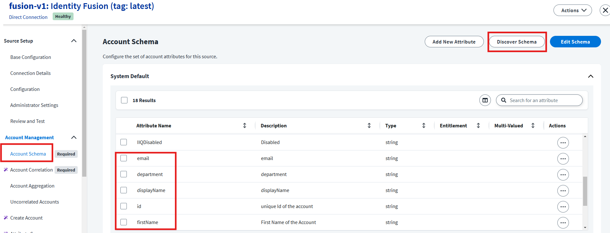

In this example, the connector found the attributes that need mapping and potential merging ('email', 'department', and 'displayName'), as well as several others that don't ('IIQDisabled', 'id', 'firstName').

:::note

Depending on the attribute merge configuration, the connector may return some attributes as multi-valued entitlements. If you're changing the attribute merge settings and your changes may result in changes to multi-valued attributes after the first schema discovery, you must review your schema and change it accordingly (ISC doesn't do this for you). You can also remove optional schema attributes to prevent the connector from fetching undesired data. 

:::

## Create identity profile

In ISC, identity profiles allow you to preconfigure the identity attributes you want to create or map from source account attributes when you create an identity. Before you can use the fusion connector to aggregate source account data into ISC, you must set up the fusion connector's identity profile so ISC can determine how to create identities from the connector's incoming account data. 

Follow these steps to create the identity profile for the fusion connector: 

1. Create an identity profile for the fusion connector and set the mappings according to the fields the connector is creating (required). To learn how to create an identity profile, refer to [Creating Identity Profiles](https://documentation.sailpoint.com/saas/help/setup/identity_profiles.html). 

2. There is a special transform the fusion connector creates in ISC that you must use to update the lifecycle state. You must set configure the 'Lifecycle State' mapping in the way shown in this screenshot (required). 

## Create provisioning plan

Within identity profiles in ISC, you can create provisioning plans, which determine what access the created identities will have and whether they'll be enabled or disabled. For the fusion connector's transform to take effect, you must create a provisioning plan called 'Staging'. This provisioning plan ensures that when the connector creates new accounts, the accounts are immediately created. Without this provisioning plan, ISC would need to run the accounts through aggregation twice before creating them. 

To create the provisioning plan, follow these steps: 

1. Within the identity profile you created, create a provisioning plan called "Staging" (required). 

2. Enable the provisioning plan (required). 

3. Choose the 'Configure Changes' option in the 'Settings for Previous Accounts' section (required). 

4. Choose the 'Enable Accounts' option in the 'Account Configuration Options' section (required). 

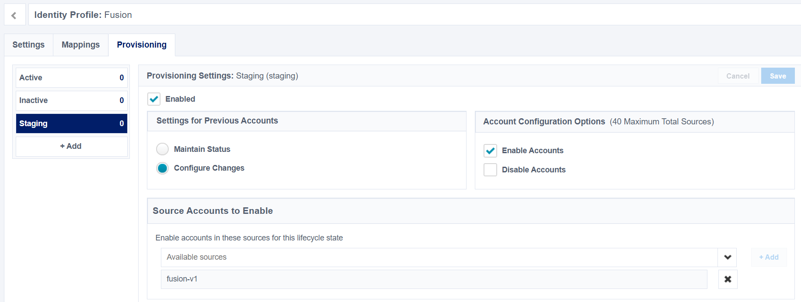

## Aggregate entitlements

In ISC, entitlements refer to the access rights an account has on a source. Once you have created the identity profile and the provisioning plan, you can aggregate entitlements from the primary source. To do so, return to the fusion connector's configuration and go to the 'Entitlement Aggregation' section. Select 'Start Aggregation' to aggregate the entitlements. 

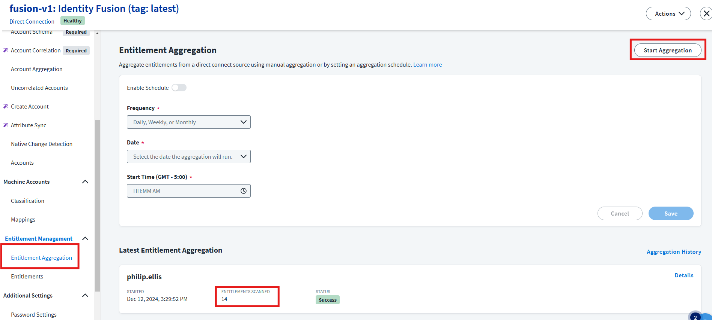

When you run an entitlement aggregation, the fusion connector connector populates all the different statuses with descriptions.

When your entitlement aggregation is successful, the 'Latest Entitlement Aggregation' section populates with the timestamp of the aggregation, the number of entitlements scanned, and a status of 'Success'. You can then see the aggregated entitlements in the 'Entitlements' section. 

To learn more about entitlements and entitlement aggregation, refer to [Loading Entitlements](https://documentation.sailpoint.com/saas/help/setup/load_entitlements.html). 

## Aggregate accounts 

You can now aggregate the source accounts. To do so, go to the 'Account Aggregation' section. Select 'Start Aggregation' to aggregate the accounts. 

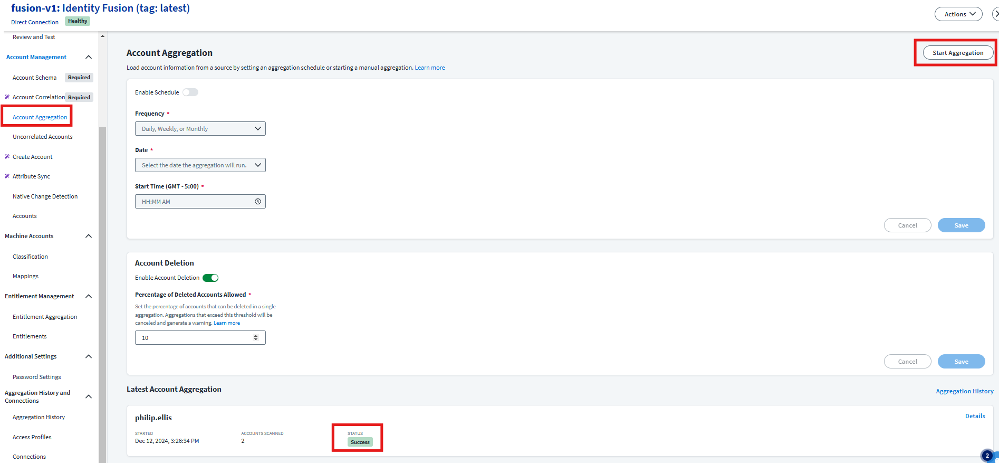

When your account aggregation is successful, the 'Latest Account Aggregation' section populates with the timestamp of the aggregation, the number of accounts scanned, and a status of 'Success'. You can then see the aggregated accounts in the 'Accounts' section. 

To learn more about account aggregation, refer to [Loading Account Data](https://documentation.sailpoint.com/saas/help/accounts/loading_data.html). 

## Add secondary sources

Now that you can aggregate account data from your primary source, you can add secondary sources that the fusion connector can use to merge account data. 

To add secondary sources, follow the same steps you used to configure the primary source. With each source you add, make sure that you discover the schema and run an entitlement aggregation. 

## Configure deduplication

If you want to use deduplication, the next step to configuring the fusion connector is setting up the deduplication check and review process. 

- **List of identity attributes to include in form**: The list of identity attributes to include in the deduplication form.

- **Manual reviewer identity or governance group**: The UID of the reviewer or the governance group name.

- **Manual review expiration days** (required): The number of days until the form instance expires.

- **Minimum similarity score [0-100] (LIG3 similarity function \* 100 from Levenshtein distance)** (required): The similarity score to apply attribute by attribute. 0 is totally different and 100 is exactly the same. 

## Create access profile for deduplication

In ISC, access profiles are bundles of entitlements representing sets of access from a single source. To configure the fusion connector's deduplication functionality, you must create some access profiles. Go to 'Access Profiles' to get started. 

First, create an access profile called 'Fusion Report'. ISC will request this access profile whenever you want to display a report that shows incoming identities and their potential matches with other existing identities in ISC. To configure the report, you must add the 'Fusion report' entitlement to the access profile. 

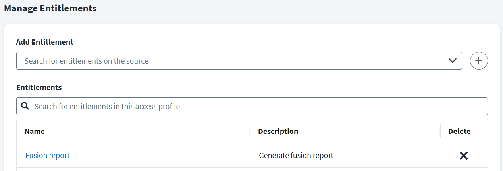

Next, you must add an access profile for each source that uses the fusion connector. For each access profile you add, add an entitlement for each source and name the entitlement "<source name> reviewer". When someone has access to this entitlement, ISC will notify and email that person to serve as a reviewer when the fusion connector detects a potential duplicate identity for that source. 

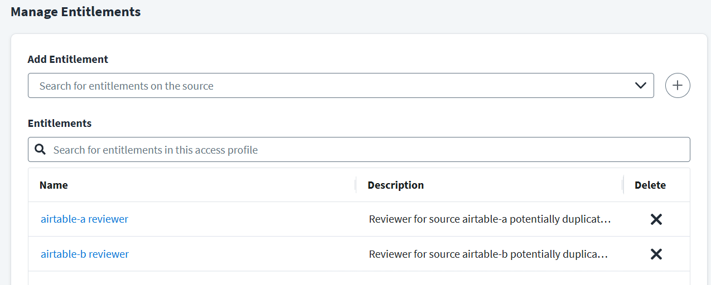

To learn more about access profiles and how to configure and manage them, refer to [Managing Access Profiles](https://documentation.sailpoint.com/saas/help/access/access-profiles.html). 

## Generate deduplication report

You may actually want to generate a report to detect potential duplicate accounts before you even run an aggregation. To do so, request access to the 'Fusion Report' access profile. To learn more about requesting access, refer to [Working with access requests](https://documentation.sailpoint.com/saas/user-help/requests/request_center.html). 

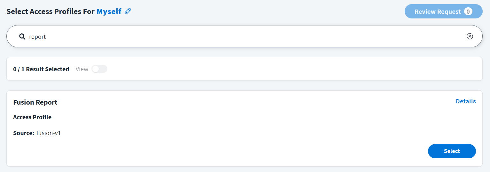

Once you have access to the access profile, ISC will send you an email listing any potential duplicate accounts and their potential matching identities in ISC when the connector finds them. 

## How to resolve potential duplicates

When an aggregation event occurs on the fusion connector, it compares all new accounts from all child sources to all identities in ISC. If it finds any duplicates, it creates a form, assigns all the reviewers to the source, and sends the reviewers that form. The form provides reviewers with the option to update the identity's attributes and select whether the account is a new identity or a duplicate of an existing one. 

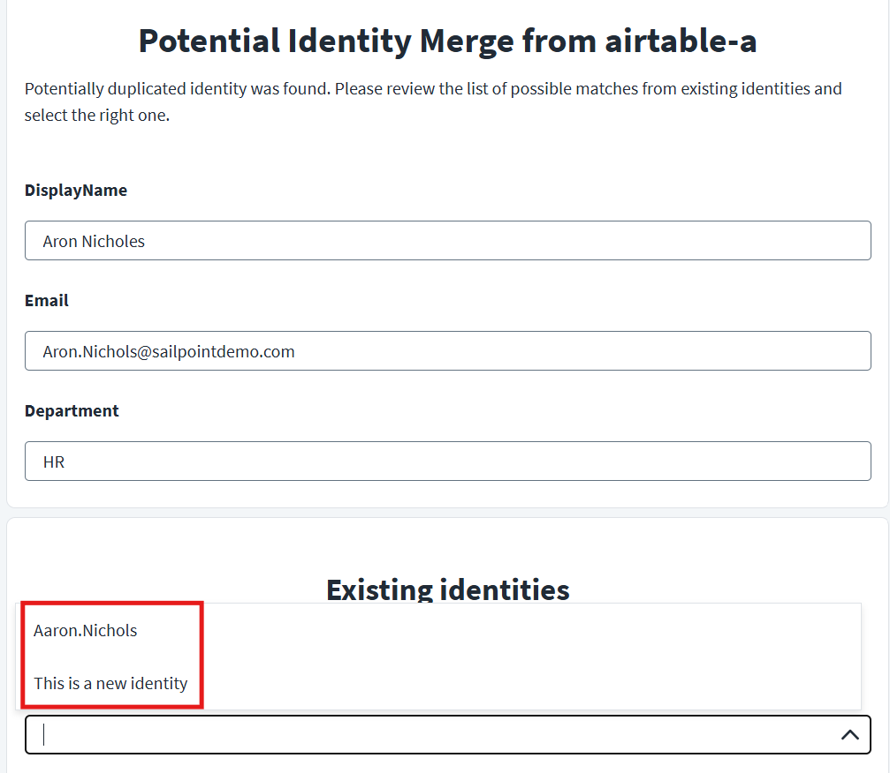

Once the first reviewer resolves the potential duplicate, the connector creates the account during its next aggregation cycle. 

## Contributing

Contributions are what make the open source community such an amazing place to learn, inspire, and create. Any contributions you make are **greatly appreciated**.

If you have a suggestion that would improve this project, please fork the repo and create a pull request. You can also open an issue with the tag `enhancement`.
Don't forget to give the project a star! Thanks again!

1. Fork the Project
2. Create your Feature Branch (`git checkout -b feature/AmazingFeature`)
3. Commit your Changes (`git commit -m 'Add some AmazingFeature'`)
4. Push to the Branch (`git push origin feature/AmazingFeature`)
5. Open a Pull Request

<!-- LICENSE -->

## License

Distributed under the MIT License. See `LICENSE.txt` for more information.

<!-- CONTACT -->

## Discuss

[Click Here](https://developer.sailpoint.com/dicuss/tag/{tagName}) to discuss this tool with other users.
